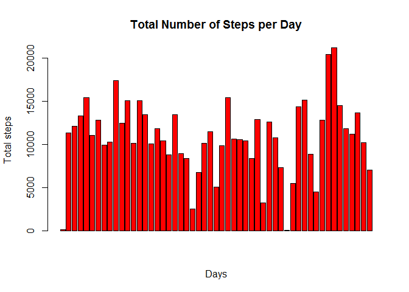

# Reproducible Research: Peer Assessment 1

## Loading and preprocessing the data

1. Load the data (i.e. read.csv())


```r
unzip("activity.zip")
rawdata <- read.csv("activity.csv")
```

2. Process/transform the data (if necessary) into a format suitable for your
analysis


```r
#Omit NA
data <- na.omit(rawdata)

#Convert date field to date type
data$date <- as.Date(data$date) 

# Use aggregate to determine steps per date
data <- aggregate(steps ~ date, data, sum)
```

## What is mean total number of steps taken per day?
For this part of the assignment, you can ignore the missing values in the dataset.

1. Make a histogram of the total number of steps taken each day


```r
hist(data$steps, col="red", xlab="Total steps per day", ylab="Number of days", main="Total Steps Taken Per Day")
```

 

2. Calculate and report the mean and median total number of steps taken
per day


```r
fmean <- mean(data$steps)

fmedian <- median(data$steps) 
```
The mean is 1.0766189\times 10^{4} and median is 10765 of total steps per day:

## What is the average daily activity pattern?

1. Make a time series plot (i.e. type = "l") of the 5-minute interval (x-axis)
and the average number of steps taken, averaged across all days (y-axis)


```r
# aggregate steps as interval to get average number of steps in an interval across all days
stepsinterval <- aggregate(steps ~ interval, rawdata, mean)

# generate the line plot of the 5-minute interval (x-axis) and the average number of 
# steps taken, averaged across all days (y-axis)
plot(stepsinterval$interval, stepsinterval$steps, type='l', col=1, 
     main="Average number of steps averaged over all days", xlab="Interval", 
     ylab="Average number of steps")
```

 

2. Which 5-minute interval, on average across all the days in the dataset,
contains the maximum number of steps?


```r
# find row id of maximum average number of steps in an interval
maxavgsteps <- which.max(stepsinterval$steps)

# get the interval with maximum average number of steps in an interval
tsteps <- stepsinterval [maxavgsteps, ]
```

The following is the interval with the maximum nuber of steps: 835, 206.1698113 steps

## Imputing missing values

Note that there are a number of days/intervals where there are missing values
(coded as NA). The presence of missing days may introduce bias into some
calculations or summaries of the data.

1. Calculate and report the total number of missing values in the dataset
(i.e. the total number of rows with NAs)


```r
# get rows with NA's
dataNAs <- rawdata[!complete.cases(rawdata),]

# number of rows
 
emptyrows <- nrow(dataNAs)
```

The data contains 2304 missing values in the dataset

2. Devise a strategy for filling in all of the missing values in the dataset. The
strategy does not need to be sophisticated. For example, you could use
the mean/median for that day, or the mean for that 5-minute interval, etc.


```r
for (i in 1:nrow(data)){
  if (is.na(data$steps[i])){
    intervalval <- data$interval[i]
    row_id <- which(intervalsteps$interval == intervalval)
    steps_val <- intervalsteps$steps[row_id]
    data$steps[i] <- steps_val
  }
}
```

3. Create a new dataset that is equal to the original dataset but with the
missing data filled in.


```r
# aggregate steps per date to get total number of steps in a day
stepsperdate <- aggregate(steps ~ date, data, sum)
```

4. Make a histogram of the total number of steps taken each day and Calculate
and report the mean and median total number of steps taken per day. Do
these values differ from the estimates from the first part of the assignment?
What is the impact of imputing missing data on the estimates of the total
daily number of steps?


```r
# creates histogram of total number of steps in a day
hist(stepsperdate$steps, col="red", main="Histogram of total number of steps per day", xlab="Total number of steps in a day")
```

 

```r
# get mean and median of total number of steps per day
tmean <- mean(stepsperdate$steps)
```

```r
tmedian <- median(stepsperdate$steps)
```

The mean value is 1.0766189\times 10^{4} and median is 10765 for total number of steps taken per day. Do
these values differ from the estimates from the first part of the assignment? Due to data imputation, the means remain same whereas there is slight change in median value.

## Are there differences in activity patterns between weekdays and weekends?

For this part the weekdays() function may be of some help here. Use the dataset
with the filled-in missing values for this part.

1. Create a new factor variable in the dataset with two levels - "weekday"
and "weekend" indicating whether a given date is a weekday or weekend
day.


```r
# convert date from string to Date class
rawdata$date <- as.Date(rawdata$date, "%Y-%m-%d")

# add a new column indicating day of the week 
rawdata$day <- weekdays(rawdata$date)

# add a new column called day type and initialize to weekday
rawdata$daytype <- c("weekday")

# If day is Saturday or Sunday, make daytype as weekend
for (i in 1:nrow(rawdata)){
  if (rawdata$day[i] == "Saturday" || rawdata$day[i] == "Sunday"){
    rawdata$daytype[i] <- "weekend"
  }
}

# convert day_time from character to factor
rawdata$daytype <- as.factor(rawdata$daytype)

# aggregate steps as interval to get average number of steps in an interval across all days
stepsbyinterval <- aggregate(steps ~ interval+daytype, rawdata, mean)
```

2. Make a panel plot containing a time series plot (i.e. type = "l") of the
5-minute interval (x-axis) and the average number of steps taken, averaged
across all weekday days or weekend days (y-axis).


```r
# make the panel plot for weekdays and weekends
library(ggplot2)

qplot(interval, steps, data=stepsbyinterval, geom=c("line"), xlab="Interval", 
      ylab="Number of steps", main="") + facet_wrap(~ daytype, ncol=1)
```

 
